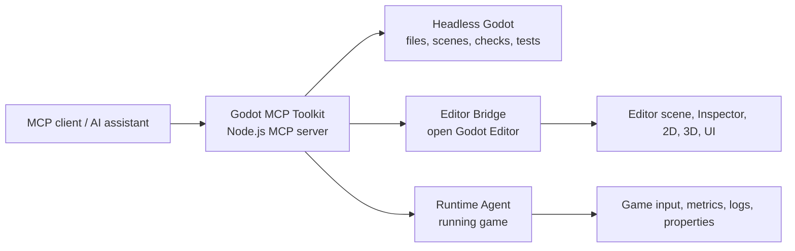

# Godot MCP Toolkit

[简体中文](README.zh-CN.md) · [Capabilities](docs/capabilities.md) · [Editor Bridge](docs/editor-bridge.md) · [Compatibility](docs/compatibility.md) · [Roadmap](docs/roadmap.md)

**Godot MCP Toolkit** gives an MCP client a structured, Godot-aware way to inspect, author, run, test, and debug Godot 4 projects. It combines reproducible headless automation with an optional live **Editor Bridge** and **Runtime Agent**, so an assistant can move from project understanding to scene iteration and runtime verification without fragile screen-coordinate automation.

> **Ask for outcomes, not clicks.** Try: “Create a responsive pause menu,” “add a 3D camera and key light,” or “run the current scene and watch the player's health and frame time.” The toolkit maps those requests to Godot-native operations.

## Why This Toolkit

| Need | Toolkit approach | Practical benefit |
| --- | --- | --- |
| Generate or repair project files | Headless Godot operations | Repeatable edits that do not require an open Editor |
| Edit an open scene safely | Live Editor Bridge | Scene-tree and Inspector changes with selection context and Undo/Redo support |
| Build 2D, 3D, and UI content | Semantic authoring tools | Request a camera, light, layout, material, or effect directly |
| Debug a running game | Runtime Agent | Inspect nodes, watch values, inject input, and collect logs or frame metrics |
| Keep the client manageable | Tool groups | Expose only the capabilities a task needs instead of a flat tool list |

## Three Connected Modes



### Headless automation — no plugin required

Use this for deterministic project work: discover projects, create scenes and nodes, edit resources, generate GDScript, validate scripts, capture screenshots, run automation tests, inspect TileMaps, and profile scenes. Project-facing operations accept an explicit `projectPath`, which makes multi-project work predictable.

### Live Editor Bridge — author inside Godot

Enable the included plugin when an assistant needs the currently open Editor: inspect or edit the scene tree, change Inspector properties, make selections, manipulate 2D/3D content, work with UI, effects, animation, navigation, physics, audio, themes, plugins, and workspace controls.

### Runtime Agent — inspect the game that is running

The plugin registers the Runtime Agent as an autoload. It supports remote scene/property inspection, method calls, pause/resume/single-step, screenshots, 2D/3D ray queries, AudioServer control, keyboard/pointer/touch injection, logs, property watches, and rolling frame metrics.

## What You Can Do

| Area | Example capabilities | Why it is useful |
| --- | --- | --- |
| **Project intelligence** | Discover projects, read `project.godot`, search files, inspect resources and UIDs, build compact project context | Understand an unfamiliar project before changing it |
| **Scene authoring** | Create, inspect, duplicate, and save scenes; add, move, rename, remove, and configure nodes | Turn structured requests into Godot-native scene changes |
| **2D and TileMap** | Create sprites and Control nodes, 2D cameras/lights, inspect TileMaps, set cells | Iterate on levels and presentation without manual node setup |
| **3D editing** | Create primitive meshes, cameras, lights, transforms, standard materials, and material assignments | Block out and light a playable 3D scene quickly |
| **UI authoring** | Create screens and semantic controls, configure layouts, inspect UI hierarchy, apply theme overrides | Produce consistent menus, HUDs, dialogs, and responsive layouts |
| **Visual style** | Particles, shaders, screen flashes, post-process environments, CanvasModulate, animation effects, stylized 2D palette and 3D filmic rendering | Establish a cohesive visual direction with named parameters |
| **Animation and systems** | Animation tracks/keys, AnimationTree state, navigation nodes/agents, collision shapes, physics-node inspection | Cover common gameplay-system setup without hiding details in generated files |
| **Audio and Editor tools** | Audio buses and players, Script Editor navigation/debug state, breakpoints, plugin toggles, workspace controls, resource reimport | Keep supporting workflows close to scene authoring |
| **Runtime debugging** | Remote tree/property access, method calls, pause/step, physics queries, audio control, captures | Diagnose live behavior instead of inferring it from files alone |
| **Runtime observability** | Watched properties, change-event polling, runtime logs, rolling FPS/frame-time/memory metrics | Follow a value or performance trend during a playtest |
| **Input simulation** | Key and mouse buttons, cursor movement, wheel, touch, touch-drag, and complete mouse drags | Exercise player and UI flows without taking over the desktop |

See the complete, versioned list in [docs/capabilities.md](docs/capabilities.md).

## Quick Start

### Prerequisites

- Node.js **18 or later**.
- A Godot **4.x** executable. Set it through `GODOT_BIN` or `GODOT_PATH`, or expose `godot` / `godot4` on `PATH`.
- A local MCP client that can start a stdio server.

### Build the server

```powershell
git clone https://github.com/woyucbugongdaitian/godot-mcp-toolkit.git
Set-Location godot-mcp-toolkit
npm.cmd install
npm.cmd run build
```

### Add the MCP entry

Replace the example paths with paths on your machine:

```json
{
  "mcpServers": {
    "godot-mcp-toolkit": {
      "command": "node",
      "args": ["E:/Tools/godot-mcp-toolkit/build/index.mjs"],
      "env": {
        "GODOT_PATH": "E:/Tools/Godot/Godot_v4.7-stable_win64.exe",
        "GODOT_MCP_PROJECT": "E:/Games/MyGodotProject"
      }
    }
  }
}
```

`GODOT_MCP_PROJECT` is optional. Without it, pass an absolute `projectPath` to each project-facing tool. A ready-to-copy template is in [examples/mcp-config.json](examples/mcp-config.json).

### Verify the connection

Ask your MCP client to call `get_server_info`, then `get_godot_version`. For a first project inspection, call `get_project_info` and `get_game_context` with the target `projectPath`.

## Enable Live Editor and Runtime Control

Live features are opt-in. They require the plugin and stay out of the default workflow when they are not needed.

1. Copy `godot/addons/godot_mcp_pro` into the target project as `addons/godot_mcp_pro`.
2. In Godot, open **Project Settings → Plugins** and enable **Godot MCP Toolkit**.
3. Add these variables to the MCP server entry:

```json
{
  "GODOT_MCP_ENABLE_EDITOR_BRIDGE": "1",
  "GODOT_MCP_TOOL_GROUPS": "all"
}
```

4. Reload the Godot project and reconnect the MCP client.
5. Call `bind_editor` before editing the open Editor. Use `run_project`, then `get_runtime_info`, when you want live game control.

On Windows, the installer can copy the plugin and generate a starter MCP configuration:

```powershell
.\portable\install.ps1 -ProjectPath "E:\Games\MyGodotProject" -GodotPath "E:\Tools\Godot\Godot_v4.7-stable_win64.exe"
```

It does **not** enable the plugin inside Godot automatically. See [docs/editor-bridge.md](docs/editor-bridge.md) for setup and binding behavior.

## Use Only the Tools You Need

Set `GODOT_MCP_TOOL_GROUPS` to a comma-separated list so the MCP client sees the capabilities relevant to the current task:

| Focus | Suggested groups |
| --- | --- |
| Project repair or code generation | `project,scenes,nodes,scripts,resources,performance,ai,diagnostics` |
| 2D level and UI work | `editor,ui,effects,project,scenes,nodes,scripts,visuals,tilemap` |
| 3D blockout and game systems | `editor,advanced_editor,effects,project,scenes,nodes,animation,resources` |
| Runtime test and debug pass | `runtime,performance,diagnostics` |
| Full workstation setup | `all` |

`editor`, `ui`, `effects`, and `advanced_editor` require the live Editor Bridge. Remote runtime tools also require the plugin; headless project runs, captured output, input simulation, and automation tests remain available without it.

## Common Workflows

### Understand and improve an existing project

1. Call `get_project_info`, `list_scenes`, and `get_game_context`.
2. Ask the assistant to identify the relevant scene, scripts, and resources.
3. Make focused changes with `create_script`, `write_file`, scene tools, or live Editor operations.
4. Run `check_project`, `analyze_script`, and `run_automation_test` before moving on.

**Example request:** “Inspect this project, find the title scene, add a start button that loads the main scene, and run parser checks.”

### Build a polished 2D screen

1. Enable the Editor Bridge and call `bind_editor`.
2. Create a screen with `create_ui_screen` and controls with `create_ui_component`.
3. Use `configure_control_layout`, `set_theme_override`, and `inspect_ui_layout` to refine it.
4. Add a transition, particle, or palette pass with the effects tools, then capture an Editor screenshot.

**Example request:** “Create a responsive pause menu with Resume, Settings, and Quit actions. Center it, use a dark translucent panel, and add a quick fade-in.”

### Block out and light a 3D prototype

1. Create a root scene and add primitive meshes.
2. Add a `create_3d_camera`, `create_3d_light`, collision shapes, and navigation nodes.
3. Use `set_editor_transform`, material tools, and `configure_stylized_rendering` to establish composition and mood.
4. Inspect the result and run the scene for a playtest.

**Example request:** “Make a small third-person test arena with a floor, three colored obstacles, a camera, soft directional lighting, and a foggy filmic look.”

### Debug a running game with live signals

1. Run the project and call `get_runtime_info` to establish the runtime binding.
2. Inspect the remote scene tree and configure watches for health, velocity, or state.
3. Call `poll_runtime_observability` during a test to receive property changes, logs, and rolling frame metrics.
4. Inject keyboard, mouse, touch, wheel, or drag input to reproduce the issue; capture a screenshot or call a runtime method when needed.
5. Finish with `release_runtime_binding` and `stop_project`.

**Example request:** “Launch the current scene, watch the player’s health and movement state, simulate a drag across the inventory, and report new warnings plus average frame time.”

## Safety, Scope, and Session Binding

- **Explicit project scope:** project operations require an absolute `projectPath` unless a default project is configured.
- **One conversation, one live target:** the first Editor or Runtime request binds that MCP server process to one project for 90 seconds of inactivity. Editor and Runtime bindings are separate.
- **Release deliberately:** call `release_editor_binding` or `release_runtime_binding` before moving the same conversation to another project.
- **Undo-aware live changes:** Editor Bridge authoring operations are designed to integrate with Godot’s Editor workflow, including Undo/Redo where the Godot API supports it.
- **Local bridge:** live communication uses loopback WebSocket connections; no cloud relay or external game service is required.
- **Graceful compatibility:** Godot 4 API differences are checked at runtime; unsupported operations return structured errors instead of crashing the MCP process.

## Project Layout

```text
server/                         MCP server and tool definitions
godot/mcp_operations.gd         Headless Godot scene/resource operations
godot/addons/godot_mcp_pro/     Editor Bridge and Runtime Agent plugin
docs/                           Setup, compatibility, capabilities, roadmap
examples/                       MCP configuration template
portable/                       Windows and shell setup/launcher helpers
test/                           MCP contract and binding coverage
```

## Documentation

| Guide | Read it when you need to… |
| --- | --- |
| [Capabilities](docs/capabilities.md) | scan the supported operation families |
| [Editor Bridge and Runtime Agent](docs/editor-bridge.md) | enable the plugin, understand ports, or release a binding |
| [Multi-project usage](docs/multi-project.md) | work safely across projects or Godot versions |
| [Compatibility](docs/compatibility.md) | check protocol and Godot support expectations |
| [Roadmap](docs/roadmap.md) | see the next deep-editor areas being prioritized |
| [Contributing](CONTRIBUTING.md) | propose changes or run local quality checks |

## Development

```powershell
npm.cmd run check
npm.cmd test
npm.cmd run build
```

The test suite covers the MCP contract and one-to-one Editor/Runtime binding behavior.

## Current Boundaries

Godot MCP Toolkit focuses on stable semantic operations, not pixel-level imitation of every Editor panel. Deep areas such as mesh/skeleton editing, advanced animation graph authoring, Navigation mesh baking, detailed physics debug visualization, Audio Bus effect-chain analysis, export preset execution, and advanced TileMap/Theme sub-editing remain active roadmap work. See [docs/roadmap.md](docs/roadmap.md) for the current direction.

## License and Attribution

Released under the [MIT License](LICENSE). This is an independent community implementation; see [NOTICE.md](NOTICE.md) for attribution details.