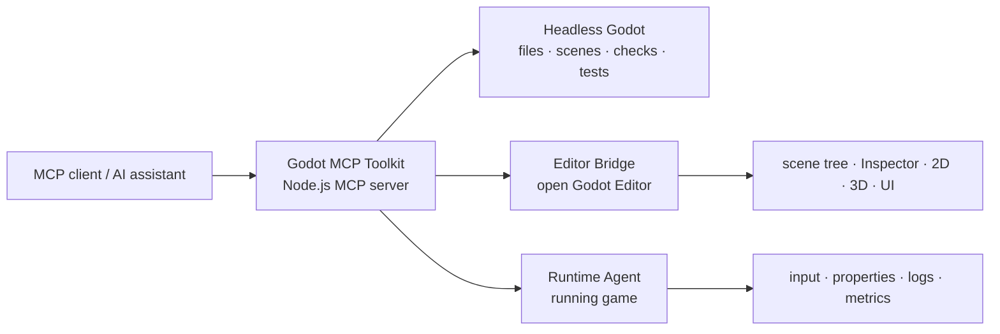

# Godot MCP Toolkit

> Give an MCP client a structured, Godot-aware way to inspect, author, run, test, and debug Godot 4 projects.

[](https://godotengine.org/)
[](https://nodejs.org/)
[](https://modelcontextprotocol.io/)
[](LICENSE)
[](README.zh-CN.md)

[简体中文](README.zh-CN.md) · [Detailed tutorial (中文)](docs/tutorial.zh-CN.md) · [Capabilities](docs/capabilities.md) · [Editor Bridge](docs/editor-bridge.md) · [Compatibility](docs/compatibility.md) · [Roadmap](docs/roadmap.md)

Godot MCP Toolkit connects an MCP client to Godot through deterministic headless operations, an optional live **Editor Bridge**, and a **Runtime Agent**. The result is a workflow that starts with project understanding and ends with verified scene changes or runtime evidence—without relying on fragile screen-coordinate automation.

> [!TIP]
> Ask for outcomes instead of clicks: “Create a responsive pause menu”, “add a camera and key light to the arena”, or “run the scene and report health changes plus frame time.”

## Choose Your Path

| You want to… | Start with… | Plugin required? |
| --- | --- | --- |
| Inspect or modify project files, scenes, scripts, and resources | [Headless workflow](#quick-start) | No |
| Edit an open scene with Godot context, selection, and Undo/Redo | [Editor Bridge](docs/editor-bridge.md) | Yes |
| Inspect and control a running game | [Runtime workflow](docs/tutorial.zh-CN.md#五运行时调试与问题复现) | Yes |
| Keep the MCP tool list small | [Tool groups](#expose-only-the-tools-you-need) | No |

## At a Glance



### Three connected modes

- **Headless automation** — discover projects, create scenes, edit nodes and resources, generate or validate GDScript, capture screenshots, run tests, inspect TileMaps, and profile scenes.
- **Live Editor Bridge** — work with the currently open Godot Editor: scene tree, Inspector properties, selections, 2D/3D content, UI, effects, animation, navigation, physics, audio, themes, plugins, and workspace state.
- **Runtime Agent** — inspect remote nodes and properties, call methods, pause/resume/step, inject keyboard or pointer input, capture screenshots, query ray, point, and primitive-shape physics overlaps, query navigation paths, control audio, watch values, and collect logs or frame metrics.

## What It Covers

| Area | Examples | Typical result |
| --- | --- | --- |
| **Project intelligence** | `get_project_info`, file search, resources, UIDs, project context | Understand an unfamiliar project before editing it |
| **Scene authoring** | Create, inspect, duplicate, save, add, move, rename, remove, and configure nodes | Make reproducible scene changes from structured requests |
| **2D and UI** | Sprites, Control nodes, cameras, lights, UI screens, layout, Theme overrides | Build menus, HUDs, dialogs, and 2D prototypes |
| **3D authoring** | Primitive and editable ArrayMesh surfaces, cameras, lights, transforms, StandardMaterial, stylized rendering | Block out, inspect, and revise a playable 3D scene |
| **Gameplay systems** | Animation tracks, Bezier curves, timeline settings, AnimationTree state machines, navigation nodes, agents, collision shapes, audio | Set up common systems without hiding changes in generated files |
| **Runtime verification** | Remote tree/properties, input injection, screenshots, ray/point/shape overlap queries, navigation paths, watches, logs, metrics | Reproduce issues and verify behavior with evidence |

See the complete operation inventory in [docs/capabilities.md](docs/capabilities.md).
> **Tool inventory:** 43 headless tools by default, or 149 unique built-in tools when the Editor Bridge is enabled with `GODOT_MCP_TOOL_GROUPS=all`. The detailed inventory is organized into 23 reader-friendly categories in [docs/capabilities.md](docs/capabilities.md).

## Quick Start

### 1. Check prerequisites

- Node.js **18 or newer**.
- Godot **4.x** available through `GODOT_BIN`, `GODOT_PATH`, or the `godot` / `godot4` command on `PATH`.
- An MCP client that can launch a local stdio server.

### 2. Install and build

```powershell
git clone https://github.com/woyucbugongdaitian/godot-mcp-toolkit.git
Set-Location godot-mcp-toolkit
npm.cmd install
npm.cmd run build
```

The generated entry point is `build/index.mjs`. Build from the repository root so the server can resolve its bundled Godot operation script.

### 3. Update an existing installation

If you originally installed by cloning the repository, update it from the Toolkit directory:

```powershell
git pull
npm.cmd install
npm.cmd run build
```

Restart the MCP client after the update. If the release includes Godot plugin changes, synchronize the copied plugin into the target project again:

```powershell
.\portable\install.ps1 `
  -ProjectPath "E:\Games\MyGodotProject" `
  -GodotPath "E:\Tools\Godot\Godot.exe"
```

The plugin is copied into the target project's `addons/godot_mcp_pro`; `git pull` does not update that project copy automatically. The installer creates a timestamped backup before replacing an existing plugin. For a global installation, run `portable/install-global.ps1` again after updating the repository. When projects are launched through `Open with Godot MCP`, the launcher synchronizes the plugin during startup.

### 4. Add the MCP server

Copy this entry into your MCP client configuration and replace the two paths:

```json
{
  "mcpServers": {
    "godot-mcp-toolkit": {
      "command": "node",
      "args": ["E:/Tools/godot-mcp-toolkit/build/index.mjs"],
      "env": {
        "GODOT_PATH": "E:/Tools/Godot/Godot_v4.x-stable_win64.exe",
        "GODOT_MCP_PROJECT": "E:/Games/MyGodotProject"
      }
    }
  }
}
```

`GODOT_MCP_PROJECT` is optional. If it is omitted, pass an absolute `projectPath` to each project-facing tool. A ready-to-copy template is available at [examples/mcp-config.json](examples/mcp-config.json).

### 5. Verify the connection

Ask the MCP client to call these tools in order:

1. `get_server_info` — confirms the server is reachable and reports capabilities.
2. `get_godot_version` — confirms the Godot executable can be launched.
3. `get_project_info` — reads project metadata and selected settings.
4. `get_game_context` — builds a compact project graph for the assistant.

If all four calls succeed, the headless workflow is ready. Continue with the [detailed tutorial](docs/tutorial.zh-CN.md) for a full inspect → edit → verify loop.

## Enable Live Editor and Runtime Control

Live features are opt-in. They require the plugin and remain out of the default workflow when you only need headless automation.

1. Copy `godot/addons/godot_mcp_pro` into the target project as `addons/godot_mcp_pro`.
2. In Godot, open **Project Settings → Plugins** and enable **Godot MCP Toolkit**.
3. Add the following variables to the MCP server entry:

```json
{
  "GODOT_MCP_ENABLE_EDITOR_BRIDGE": "1",
  "GODOT_MCP_TOOL_GROUPS": "all"
}
```

4. Reload the Godot project and reconnect the MCP client.
5. Call `bind_editor` before editing the open Editor.
6. For runtime control, call `run_project`, then `get_runtime_info`.

On Windows, the installer can copy the plugin and generate a starter configuration:

```powershell
.\portable\install.ps1 -ProjectPath "E:\Games\MyGodotProject" -GodotPath "E:\Tools\Godot\Godot_v4.x-stable_win64.exe"
```

The installer does **not** enable the plugin inside Godot automatically. See [docs/editor-bridge.md](docs/editor-bridge.md) for binding rules and [docs/tutorial.zh-CN.md](docs/tutorial.zh-CN.md) for a complete walkthrough.

## Expose Only the Tools You Need

Set `GODOT_MCP_TOOL_GROUPS` to a comma-separated list so the MCP client sees only the capabilities relevant to the current task:

| Focus | Suggested groups |
| --- | --- |
| Project repair or code generation | `project,scenes,nodes,scripts,resources,performance,ai,diagnostics` |
| 2D level and UI work | `editor,ui,effects,project,scenes,nodes,scripts,visuals,tilemap` |
| 3D blockout and deep authoring | `editor,advanced_editor,deep_authoring,effects,project,scenes,nodes,animation,resources` |
| Runtime test and debugging | `runtime,performance,diagnostics` |
| Full workstation setup | `all` |

The `editor`, `ui`, `effects`, `advanced_editor`, and `deep_authoring` groups require the live Editor Bridge. Remote runtime tools also require the plugin; `run_project`, output capture, headless input simulation, and automation tests remain available without it.

## Workflow Recipes

### Understand and improve an existing project

1. Call `get_project_info`, `list_scenes`, and `get_game_context`.
2. Ask the assistant to identify the relevant scene, scripts, and resources.
3. Make focused changes with project, scene, script, or live Editor tools.
4. Run `check_project`, `analyze_script`, and `run_automation_test` before moving on.

**Example request:** “Inspect this project, find the title scene, add a start button that loads the main scene, and run parser checks.”

### Build a polished 2D screen

1. Enable the Editor Bridge and call `bind_editor`.
2. Create a hierarchy with `create_ui_screen` and `create_ui_component`.
3. Refine layout with `configure_control_layout`, theme with `set_theme_override`, and structure with `inspect_ui_layout`.
4. Add a transition or visual pass, then capture an Editor screenshot for review.

**Example request:** “Create a responsive pause menu with Resume, Settings, and Quit actions. Center it, use a dark translucent panel, and add a quick fade-in.”

### Debug a running game with live signals

1. Run the project and call `get_runtime_info` to establish the runtime binding.
2. Inspect the remote tree and configure watches for health, velocity, or state.
3. Poll `poll_runtime_observability` while reproducing the issue.
4. Inject keyboard, mouse, touch, wheel, or drag input and capture evidence.
5. Finish with `release_runtime_binding` and `stop_project`.

**Example request:** “Launch the current scene, watch the player’s health and movement state, simulate an inventory drag, and report new warnings plus average frame time.”

## Configuration Reference

| Variable | Required | Purpose |
| --- | --- | --- |
| `GODOT_BIN` | No | Preferred Godot executable path for local launches and portable helpers. |
| `GODOT_PATH` | No | Alternate Godot executable path used by the MCP server configuration. |
| `GODOT_MCP_PROJECT` | No | Default absolute project path for project-facing operations. |
| `GODOT_MCP_ENABLE_EDITOR_BRIDGE` | No | Set to `1` to enable live Editor Bridge forwarding. |
| `GODOT_MCP_TOOL_GROUPS` | No | Comma-separated tool groups, or `all`. |
| `GODOT_MCP_RUNTIME_PORT` | No | Override the runtime port used for a launched project. |
| `GODOT_MCP_EXTENSIONS_DIR` | No | Directory containing optional `.mjs` tool extensions. |

## Session Safety

- Project-facing operations use an explicit absolute `projectPath` unless `GODOT_MCP_PROJECT` is configured.
- One MCP conversation binds to one live Editor or Runtime project at a time. Bindings expire after 90 seconds of inactivity.
- Editor and Runtime bindings are independent. Call `release_editor_binding` or `release_runtime_binding` before switching projects.
- Live Editor mutations are designed to participate in Godot’s Undo/Redo flow where the Godot API supports it.
- The bridge uses local loopback WebSockets; no cloud relay or external game service is required.
- Unsupported Godot 4.x APIs return structured errors instead of terminating the MCP process.

## Documentation Map

| Guide | Use it when you need to… |
| --- | --- |
| [中文详细教程](docs/tutorial.zh-CN.md) | follow a complete install, configuration, editing, runtime, and troubleshooting walkthrough |
| [Capabilities](docs/capabilities.md) | scan supported operation families |
| [Editor Bridge and Runtime Agent](docs/editor-bridge.md) | enable the plugin, understand ports, or release a binding |
| [Multi-project usage](docs/multi-project.md) | work safely across projects or Godot versions |
| [Compatibility](docs/compatibility.md) | check MCP protocol and Godot support expectations |
| [Roadmap](docs/roadmap.md) | see active and planned deep-editor areas |
| [Contributing](CONTRIBUTING.md) | propose changes or run local quality checks |

## Current Boundaries

Godot MCP Toolkit focuses on stable semantic operations rather than pixel-level imitation of every Editor panel. ArrayMesh surface edits, basic state-machine graphs, Bezier curves, Theme subresources, and TileSet atlas/Terrain operations are available; skeletons/skin, imported-mesh edits, complex blend graphs, Navigation mesh baking, detailed physics visualization, Audio Bus effect-chain analysis, export preset execution, and advanced TileSet/Theme inheritance remain roadmap work. See [docs/roadmap.md](docs/roadmap.md) for the current boundary.

## Development

```powershell
npm.cmd run check
npm.cmd test
npm.cmd run build
```

The test suite covers the MCP contract and one-to-one Editor/Runtime binding behavior.

## License

Released under the [MIT License](LICENSE). This is an independent community implementation; see [NOTICE.md](NOTICE.md) for attribution details.
