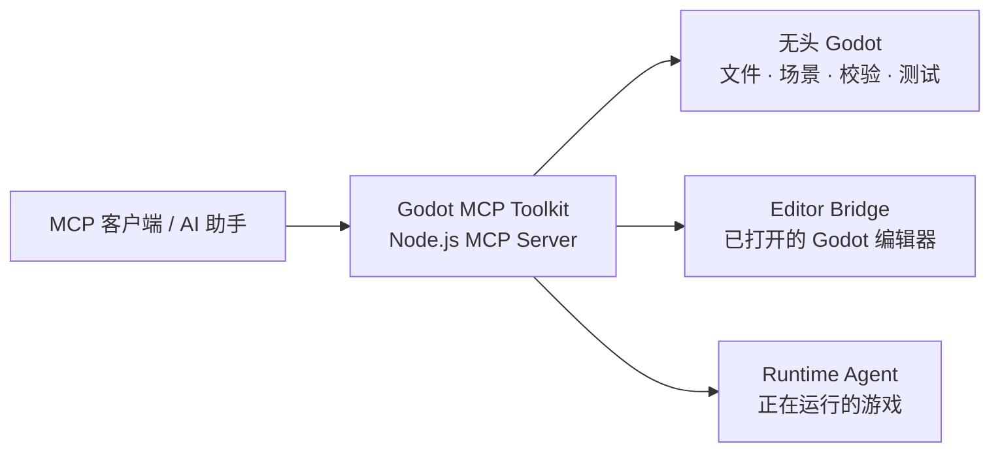

# Godot MCP Toolkit（简体中文）

[English](README.md) · [能力清单](docs/capabilities.md) · [编辑器桥接](docs/editor-bridge.md) · [兼容性](docs/compatibility.md) · [路线图](docs/roadmap.md)

**Godot MCP Toolkit** 是面向 Godot 4 的 MCP 工具集。它让支持 MCP 的 AI 客户端能够直接理解和操作 Godot 的项目、场景、节点、资源与运行时状态，而不是依靠不稳定的屏幕坐标点击。

> 你只需要描述目标，例如：“创建一个自适应暂停菜单”、“添加第三人称测试场景的相机与主光源”、“运行当前场景并监视玩家生命和帧时间”。Toolkit 会将需求映射为 Godot 感知的操作。

## 它解决什么问题？

| 常见问题 | Toolkit 的做法 | 对用户的价值 |
| --- | --- | --- |
| AI 只能修改文本，难以理解场景 | 检查和编辑场景树、节点、Inspector 属性与资源 | 使用 Godot 原生结构完成修改 |
| 重复操作依赖手工点击 | 使用无头 Godot 执行工程、场景、脚本、测试和截图操作 | 可复现，适合批处理与 CI |
| 开着 Editor 时修改容易失去上下文 | 使用一对一 Editor Bridge、选择集与 Undo/Redo | 在当前项目和场景中安全迭代 |
| 运行时只能靠猜测状态 | 使用 Runtime Agent 查看属性、日志、输入和帧指标 | 复现并验证真实游戏行为 |
| MCP 工具太多挤占上下文 | 按任务选择 `GODOT_MCP_TOOL_GROUPS` | 2D、3D、UI、运行时能力按需加载 |

## 三种使用模式



### 无头自动化：无需插件

适合工程发现与创建、场景和节点修改、资源及 UID 检查、GDScript 生成与解析、TileMap 操作、截图、自动化测试和轻量性能采样。项目操作可以传入绝对 `projectPath`，因此适合同时处理多个项目。

### 编辑器桥接：实时创作

启用插件后，可以让 AI 操作当前打开的 Godot Editor：场景树、Inspector、选择集、2D/3D 场景、UI、材质、粒子、Shader、动画、导航、物理、音频、Theme、插件和工作区。

### 运行时代理：观察真实游戏

Runtime Agent 随插件注册为 Autoload。它支持远程场景树和属性、方法调用、暂停/继续/单步、截图、2D/3D 射线查询、AudioServer、键盘/鼠标/滚轮/触摸/拖拽注入，以及属性 Watch、日志和滚动帧指标。

## 功能总览

| 方向 | 已实现内容 |
| --- | --- |
| **项目与代码** | 工程发现与创建、`project.godot` 设置、文件搜索/读写、资源与 UID、项目上下文、脚本创建/挂载/检查 |
| **场景与节点** | 创建、复制、检查、保存场景；添加、删除、移动、改名和配置节点；精灵与截图 |
| **2D 与 TileMap** | 2D 相机/灯光、Control 节点、TileMap 检查与单元格设置 |
| **3D 场景** | 原始网格、相机、灯光、Transform、StandardMaterial、材质分配和 3D 检查 |
| **UI** | UI Screen、语义控件、布局配置、Theme 覆盖、UI 层级检查 |
| **风格化渲染** | 粒子、ShaderMaterial、屏幕闪烁、后处理、CanvasModulate、动画特效、2D 调色板和 3D 电影感环境 |
| **动画与系统** | AnimationPlayer 轨道/关键帧、AnimationTree 状态、导航节点/Agent、碰撞形状、物理节点检查、音频总线/播放器 |
| **编辑器辅助** | 脚本编辑器状态和跳转、断点读取、调试状态、插件开关、工作区、资源重新导入 |
| **运行时增强** | 远程树/属性、方法调用、暂停/单步、输入注入、截图、物理查询、AudioServer、属性变化轮询、日志和帧指标 |

完整能力见 [docs/capabilities.md](docs/capabilities.md)。

## 三分钟开始使用

### 环境要求

- Node.js 18 或更高版本。
- Godot 4.x；通过 `GODOT_BIN` 或 `GODOT_PATH` 配置，或将 `godot` / `godot4` 放到 `PATH`。
- 可以启动 stdio MCP Server 的 MCP 客户端。

### 构建

```powershell
git clone https://github.com/woyucbugongdaitian/godot-mcp-toolkit.git
Set-Location godot-mcp-toolkit
npm.cmd install
npm.cmd run build
```

### MCP 配置

将路径替换为本机路径：

```json
{
  "mcpServers": {
    "godot-mcp-toolkit": {
      "command": "node",
      "args": ["E:/Tools/godot-mcp-toolkit/build/index.mjs"],
      "env": {
        "GODOT_PATH": "E:/Tools/Godot/Godot_v4.7-stable_win64.exe",
        "GODOT_MCP_PROJECT": "E:/Games/MyGodotProject"
      }
    }
  }
}
```

`GODOT_MCP_PROJECT` 可选；不设置时，每次项目操作传入绝对 `projectPath`。配置模板见 [examples/mcp-config.json](examples/mcp-config.json)。连接后先调用 `get_server_info` 和 `get_godot_version`，再调用 `get_project_info`、`list_scenes`、`get_game_context`。

## 启用 Editor 与 Runtime

1. 将 `godot/addons/godot_mcp_pro` 复制到目标项目的 `addons/godot_mcp_pro`。
2. 在 Godot **项目设置 → 插件** 中启用 **Godot MCP Toolkit**。
3. 给 MCP Server 增加：

```json
{
  "GODOT_MCP_ENABLE_EDITOR_BRIDGE": "1",
  "GODOT_MCP_TOOL_GROUPS": "all"
}
```

4. 重载 Godot 项目并重连 MCP 客户端。
5. 编辑当前场景前调用 `bind_editor`；控制运行中的游戏时先 `run_project`，再 `get_runtime_info`。

Windows 可以运行安装助手：

```powershell
.\portable\install.ps1 -ProjectPath "E:\Games\MyGodotProject" -GodotPath "E:\Tools\Godot\Godot_v4.7-stable_win64.exe"
```

安装助手会复制插件并生成配置，但不会代替你在 Godot 内启用插件。详细说明见 [docs/editor-bridge.md](docs/editor-bridge.md)。

## 按任务减少工具数量

设置 `GODOT_MCP_TOOL_GROUPS`，只暴露当前任务需要的组：

| 工作内容 | 推荐工具组 |
| --- | --- |
| 工程修复和脚本生成 | `project,scenes,nodes,scripts,resources,performance,ai,diagnostics` |
| 2D 地图和 UI | `editor,ui,effects,project,scenes,nodes,scripts,visuals,tilemap` |
| 3D 原型和玩法系统 | `editor,advanced_editor,effects,project,scenes,nodes,animation,resources` |
| 运行时测试和调试 | `runtime,performance,diagnostics` |
| 全部能力 | `all` |

`editor`、`ui`、`effects`、`advanced_editor` 需要 Editor Bridge。`runtime` 的远程控制部分也需要插件；`run_project`、输出读取、无头输入模拟和自动化测试无需插件即可使用。

## 常见工作流

### 2D / UI 地编

1. 启用桥接并调用 `bind_editor`。
2. 用 `create_ui_screen` 创建界面，用 `create_ui_component` 添加控件。
3. 用 `configure_control_layout`、`set_theme_override`、`inspect_ui_layout` 调整布局。
4. 用粒子、过渡、调色和截图工具完成评审。

**可以这样请求：** “创建响应式暂停菜单，包含继续、设置、退出三个按钮；使用深色半透明面板，居中并快速淡入。”

### 3D 地编

1. 创建根场景和原始网格。
2. 添加 `create_3d_camera`、`create_3d_light`、碰撞形状和导航节点。
3. 用 `set_editor_transform`、材质工具和 `configure_stylized_rendering` 调整构图与气氛。
4. 检查场景并运行试玩。

**可以这样请求：** “创建一个第三人称测试场，包含地面、三个彩色障碍物、相机、柔和主光和带雾电影感渲染。”

### 运行时复现问题

1. 运行工程并调用 `get_runtime_info` 建立运行时绑定。
2. 检查远程场景树，为生命、速度、状态等属性配置 Watch。
3. 轮询 `poll_runtime_observability`，收集属性变化、日志和滚动帧指标。
4. 注入键盘、鼠标移动、滚轮、触摸或拖拽来复现问题。
5. 结束时调用 `release_runtime_binding` 和 `stop_project`。

**可以这样请求：** “运行当前场景，监视玩家生命和移动状态，模拟一次背包拖拽，并报告新增警告和平均帧时间。”

## 安全与绑定规则

- 未配置默认项目时，项目操作要求绝对 `projectPath`。
- 首次实时请求会将一个 MCP 对话绑定到一个 Godot 项目，90 秒无请求后过期。
- Editor 与 Runtime 绑定相互独立；切换项目前调用对应的 `release_*_binding`。
- Editor Bridge 会尽可能接入 Godot 的 Undo/Redo 工作流。
- Bridge 使用本机回环 WebSocket，不需要云端中转。
- Godot 4.x API 差异通过运行时检查处理，不支持时返回结构化错误。

## 还没有完全实现的部分

Toolkit 已覆盖大量常见开发操作，但以下方向仍不是完整的 Godot Editor 替代品：

- **Script Editor 深度编辑：** 写入式选区、补全状态、复杂重构、完整调试堆栈与变量面板。
- **3D 深度建模：** Skeleton/skin、骨骼绑定、网格顶点编辑、完整 Transform Gizmo 和复杂材质资源编辑。
- **高级动画：** AnimationTree 状态机图编辑、曲线编辑、复杂时间轴编排和高级关键帧资源管理。
- **Navigation 与 Physics：** Navigation Mesh 烘焙、路径查询事件、接触信息、形状级调试和完整可视化。
- **Audio：** Audio Bus 效果链编辑、频谱分析、混音器仪表和完整播放状态编辑。
- **Import/Export：** Import Dock、Import 参数批量编辑、Export Preset、平台导出执行和导出前检查。
- **TileMap/Theme：** 高级地形/图集编辑、复杂 TileSet 子资源和 Theme 子资源编辑。
- **完整 Editor UI：** Project Manager、所有 Dock、布局拖拽和每个资源选择器的完整交互。

这些项目已整理到 [docs/roadmap.md](docs/roadmap.md)，后续会继续以工具组、测试和版本化文档的方式实现，避免一次性暴露难以管理的工具平面。

## 项目结构

```text
server/                         MCP Server 与工具定义
godot/mcp_operations.gd         无头 Godot 场景/资源操作
godot/addons/godot_mcp_pro/     Editor Bridge 与 Runtime Agent 插件
docs/                           能力、安装、兼容性和路线图
examples/                       MCP 配置模板
portable/                       Windows 与 Shell 安装/启动助手
test/                           MCP 合约与绑定测试
```

## 开发

```powershell
npm.cmd run check
npm.cmd test
npm.cmd run build
```

测试覆盖 MCP 合约以及 Editor/Runtime 一对一绑定行为。欢迎通过 [CONTRIBUTING.md](CONTRIBUTING.md) 提交问题和改进建议。

## 许可证

本项目采用 [MIT License](LICENSE)，归属信息见 [NOTICE.md](NOTICE.md)。