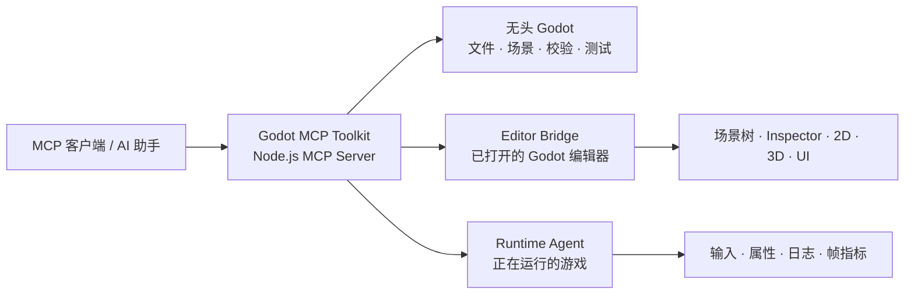

# Godot MCP Toolkit（简体中文）

> 让支持 MCP 的 AI 客户端，以结构化、可验证的方式理解、创建、修改、运行和调试 Godot 4 项目。

[](https://godotengine.org/)
[](https://nodejs.org/)
[](https://modelcontextprotocol.io/)
[](LICENSE)
[](README.md)

[English](README.md) · [详细使用教程](docs/tutorial.zh-CN.md) · [能力清单](docs/capabilities.md) · [编辑器桥接](docs/editor-bridge.md) · [兼容性](docs/compatibility.md) · [路线图](docs/roadmap.md)

Godot MCP Toolkit 通过三部分连接 MCP 客户端与 Godot：可复现的**无头自动化**、可选的实时 **Editor Bridge**，以及用于观察真实游戏的 **Runtime Agent**。它让工作流从“先理解项目”开始，以“完成修改并验证结果”结束，不需要依赖脆弱的屏幕坐标点击。

> [!TIP]
> 描述目标，而不是描述点击步骤：例如“创建自适应暂停菜单”“给测试场景添加相机和主光”“运行场景并报告生命值变化与帧时间”。

## 先选使用路径

| 你想要…… | 从这里开始 | 是否需要插件 |
| --- | --- | --- |
| 检查或修改项目文件、场景、脚本和资源 | [快速开始](#快速开始) | 否 |
| 在打开的 Godot 编辑器中保留场景上下文、选择集和 Undo/Redo | [Editor Bridge](docs/editor-bridge.md) | 是 |
| 检查和控制正在运行的游戏 | [运行时教程](docs/tutorial.zh-CN.md#五运行时调试与问题复现) | 是 |
| 减少 MCP 客户端看到的工具数量 | [按任务加载工具组](#按任务加载工具组) | 否 |

## 工作方式



### 三种模式

- **无头自动化**：工程发现与创建、场景和节点修改、资源与 UID 检查、GDScript 生成与解析、截图、自动化测试、TileMap 检查和轻量性能采样。
- **Editor Bridge**：操作当前打开的 Godot Editor，包括场景树、Inspector 属性、选择集、2D/3D 内容、UI、效果、动画、导航、物理、音频、Theme、插件和工作区。
- **Runtime Agent**：查看远程节点和属性，调用方法，暂停/继续/单步，注入键盘和鼠标/触摸输入，截图，执行射线、点和基础形状重叠物理查询，查询导航路径，控制音频，监视属性，并收集日志与帧指标。

## 能力总览

当前仓库的内置工具数量是：

- **默认 45 个**：无头项目、场景、脚本、资源、截图、测试和诊断能力；
- **开启 Editor Bridge + `GODOT_MCP_TOOL_GROUPS=all` 后 164 个唯一工具**：增加编辑器、UI、3D、动画、Runtime Agent 和深度创作能力；
- **按阅读体验整理为 23 类**：下面的分类数量相加为 164；如果通过 `GODOT_MCP_EXTENSIONS_DIR` 加载扩展，实际总数会继续增加。

<details>
<summary>展开 23 类功能清单</summary>

| 类别 | 工具数 | 能做什么 |
| --- | ---: | --- |
| **服务与诊断** | 3 | Server 健康、能力信息、Godot 版本 |
| **项目与上下文** | 7 | 项目发现、创建、设置和 AI 项目上下文 |
| **文件与搜索** | 4 | 文件列表、读写和项目搜索 |
| **资源与 UID** | 4 | 资源列表、引用关系、UID 读取与刷新 |
| **场景** | 6 | 创建、复制、保存、场景树和节点检查 |
| **节点** | 5 | 添加、删除、属性、精灵和 UI 节点 |
| **脚本** | 3 | 创建、挂载和语法检查 |
| **无头截图与校验** | 3 | 场景截图、项目检查、轻量性能采样 |
| **无头启动与测试** | 6 | 启动、停止、输出、输入模拟和自动化测试 |
| **编辑器连接与工作区** | 13 | Editor 绑定、插件、工作区、日志和资源重载 |
| **编辑器场景与选择** | 16 | 场景树、选择集、Inspector、Undo/Redo 和视口截图 |
| **编辑器脚本与调试** | 10 | Script Editor 状态、跳转、断点、调试和执行 |
| **UI、Theme 与资源** | 9 | UI 屏幕、布局、颜色、字体、StyleBox 和资源赋值 |
| **2D 与 3D 场景** | 10 | 网格、ArrayMesh、相机、灯光、Transform 和 3D 检查 |
| **材质与渲染** | 4 | StandardMaterial、材质分配、调色和风格化渲染 |
| **粒子、着色器与效果** | 7 | GPU 粒子、Shader、屏幕闪烁、后处理和视觉效果 |
| **动画与时间轴** | 10 | AnimationPlayer、轨道、关键帧、AnimationTree、曲线和时间轴 |
| **导航** | 5 | 导航节点、Agent、检查和运行时路径查询 |
| **物理** | 6 | 碰撞形状、物理配置、射线、点和形状查询 |
| **音频** | 10 | Audio Bus、播放器、播放、音量、静音和运行时状态 |
| **TileMap** | 6 | TileMap 检查、单元格、图集和地形绘制 |
| **运行时检查与控制** | 10 | 远程树、属性、方法、暂停、单步和绑定生命周期 |
| **运行时输入、观测与截图** | 7 | 键鼠/指针输入、Watch、日志、帧指标和运行时截图 |

</details>

完整工具名、代表性调用和工具组说明见 [docs/capabilities.md](docs/capabilities.md)。

## 快速开始

### 1. 准备环境

- Node.js **18 或更高版本**。
- Godot **4.x**，可通过 `GODOT_BIN`、`GODOT_PATH` 配置，或将 `godot` / `godot4` 加入 `PATH`。
- 一个能够启动本地 stdio Server 的 MCP 客户端。

### 2. 安装并构建

```powershell
git clone https://github.com/woyucbugongdaitian/godot-mcp-toolkit.git
Set-Location godot-mcp-toolkit
npm.cmd install
npm.cmd run build
```

构建后的入口是 `build/index.mjs`。请从仓库根目录构建，以便 Server 正确找到内置的 Godot 操作脚本。

### 3. 安装后更新

如果你最初是通过 Git 克隆仓库安装的，后续更新时在 Toolkit 仓库目录执行：

```powershell
git pull
npm.cmd install
npm.cmd run build
```

执行完成后重启 MCP 客户端。上面的命令会更新 MCP Server；如果本次版本包含 Godot 插件改动，还需要重新把插件同步到目标项目：

```powershell
.\portable\install.ps1 `
  -ProjectPath "E:\Games\MyGodotProject" `
  -GodotPath "E:\Tools\Godot\Godot.exe"
```

插件是复制到目标项目的 `addons/godot_mcp_pro`，不会因为 `git pull` 自动更新。安装脚本会在覆盖已有插件前创建带时间戳的备份。使用全局安装时，更新仓库后重新运行 `portable/install-global.ps1`；如果通过 `Open with Godot MCP` 启动项目，启动器会在启动时同步插件。

### 4. 配置 MCP Server

把下面配置加入 MCP 客户端，并替换两个本机路径：

```json
{
  "mcpServers": {
    "godot-mcp-toolkit": {
      "command": "node",
      "args": ["E:/Tools/godot-mcp-toolkit/build/index.mjs"],
      "env": {
        "GODOT_PATH": "E:/Tools/Godot/Godot_v4.x-stable_win64.exe",
        "GODOT_MCP_PROJECT": "E:/Games/MyGodotProject"
      }
    }
  }
}
```

`GODOT_MCP_PROJECT` 是可选项。不设置时，每次项目操作都传入绝对路径 `projectPath`。可直接复制的模板见 [examples/mcp-config.json](examples/mcp-config.json)。

### 5. 验证连接

让 MCP 客户端按顺序调用：

1. `get_server_info`：确认 Server 可访问并读取能力信息。
2. `get_godot_version`：确认可以启动指定的 Godot 可执行文件。
3. `get_project_info`：读取项目元数据和关键设置。
4. `get_game_context`：为 AI 构建紧凑的项目上下文图。

四步都成功后，无头工作流就准备好了。接着阅读[详细使用教程](docs/tutorial.zh-CN.md)，完成一次完整的“理解 → 修改 → 验证”闭环。

## 启用 Editor 与 Runtime

实时能力默认关闭。只有在需要操作打开的 Godot Editor 或正在运行的游戏时，才需要安装插件。

1. 将 `godot/addons/godot_mcp_pro` 复制到目标项目的 `addons/godot_mcp_pro`。
2. 在 Godot 中打开 **项目设置 → 插件**，启用 **Godot MCP Toolkit**。
3. 给 MCP Server 增加以下环境变量：

```json
{
  "GODOT_MCP_ENABLE_EDITOR_BRIDGE": "1",
  "GODOT_MCP_TOOL_GROUPS": "all"
}
```

4. 重载 Godot 项目，并重连 MCP 客户端。
5. 编辑打开的场景前先调用 `bind_editor`。
6. 控制运行中的游戏时，先调用 `run_project`，再调用 `get_runtime_info`。

Windows 可以使用安装助手复制插件并生成配置：

```powershell
.\portable\install.ps1 -ProjectPath "E:\Games\MyGodotProject" -GodotPath "E:\Tools\Godot\Godot_v4.x-stable_win64.exe"
```

安装助手**不会**自动替你在 Godot 内启用插件。绑定规则见 [docs/editor-bridge.md](docs/editor-bridge.md)，完整流程见 [docs/tutorial.zh-CN.md](docs/tutorial.zh-CN.md)。
### 插件安装位置（必须一致）

插件源码在仓库的 `godot/addons/godot_mcp_pro` 目录中。复制到你的 Godot 项目后，必须变成：

```text
你的项目/
├─ project.godot
└─ addons/
   └─ godot_mcp_pro/
      ├─ plugin.cfg
      ├─ plugin.gd
      └─ runtime_agent.gd
```

在 Godot 中依次打开 **Project → Project Settings → Plugins**，找到 **Godot MCP Toolkit** 并打开 **Enabled**。如果列表里没有插件，优先检查 `addons/godot_mcp_pro/plugin.cfg` 是否位于项目根目录下，而不是多了一层 `godot` 或 `addons`。

CMD 手动复制示例：

```bat
xcopy /E /I /Y "E:\Tools\godot-mcp-toolkit\godot\addons\godot_mcp_pro" "E:\Games\MyGodotProject\addons\godot_mcp_pro"
```


## 按任务加载工具组

设置 `GODOT_MCP_TOOL_GROUPS`，只让 MCP 客户端看到当前任务需要的能力：

| 工作内容 | 推荐工具组 |
| --- | --- |
| 工程修复或脚本生成 | `project,scenes,nodes,scripts,resources,performance,ai,diagnostics` |
| 2D 地图和 UI | `editor,ui,effects,project,scenes,nodes,scripts,visuals,tilemap` |
| 3D 原型和深度创作 | `editor,advanced_editor,deep_authoring,professional_workflows,effects,project,scenes,nodes,animation,resources` |
| 运行时测试和调试 | `runtime,runtime_diagnostics,performance,diagnostics` |
| 全部能力 | `all` |

`editor`、`ui`、`effects`、`advanced_editor`、`deep_authoring`、`professional_workflows` 需要 Editor Bridge；`runtime_diagnostics` 需要 Runtime Agent。Runtime 的远程控制也需要插件；`run_project`、输出读取、无头输入模拟和自动化测试无需插件即可使用。

## 常见工作流

### 理解并改进现有项目

1. 调用 `get_project_info`、`list_scenes`、`get_game_context`。
2. 让 AI 找出相关场景、脚本和资源，并说明修改范围。
3. 用项目、场景、脚本工具或实时 Editor 工具做小范围修改。
4. 运行 `check_project`、`analyze_script` 和 `run_automation_test`。

**示例请求：**“检查这个项目，找到标题场景，添加一个加载主场景的开始按钮，然后运行脚本解析检查。”

### 制作精致的 2D 界面

1. 启用 Editor Bridge 并调用 `bind_editor`。
2. 用 `create_ui_screen` 创建层级，用 `create_ui_component` 添加语义控件。
3. 用 `configure_control_layout` 调布局，用 `set_theme_override` 调样式，用 `inspect_ui_layout` 检查结构。
4. 添加过渡或视觉效果，最后截取 Editor 视口截图评审。

**示例请求：**“创建响应式暂停菜单，包含继续、设置、退出三个按钮；使用深色半透明面板，居中并快速淡入。”

### 调试正在运行的游戏

1. 运行项目并调用 `get_runtime_info`，建立 Runtime 绑定。
2. 检查远程场景树，为生命、速度或状态配置 Watch。
3. 轮询 `poll_runtime_observability`，收集属性变化、日志和滚动帧指标。
4. 注入键盘、鼠标、触摸、滚轮或拖拽输入来复现问题，并保存截图证据。
5. 结束时调用 `release_runtime_binding` 和 `stop_project`。

**示例请求：**“运行当前场景，监视玩家生命和移动状态，模拟一次背包拖拽，并报告新增警告和平均帧时间。”

## 配置速查

| 变量 | 是否必需 | 作用 |
| --- | --- | --- |
| `GODOT_BIN` | 否 | 本地启动和 portable 助手优先使用的 Godot 路径。 |
| `GODOT_PATH` | 否 | MCP Server 配置中使用的 Godot 可执行文件路径。 |
| `GODOT_MCP_PROJECT` | 否 | 项目操作默认使用的绝对项目路径。 |
| `GODOT_MCP_ENABLE_EDITOR_BRIDGE` | 否 | 设置为 `1`，启用实时 Editor Bridge 转发。 |
| `GODOT_MCP_TOOL_GROUPS` | 否 | 逗号分隔的工具组，或设置为 `all`。 |
| `GODOT_MCP_RUNTIME_PORT` | 否 | 覆盖启动项目使用的 Runtime 端口。 |
| `GODOT_MCP_EXTENSIONS_DIR` | 否 | 加载额外 `.mjs` 工具扩展的目录。 |

## 会话安全与绑定规则

- 未配置 `GODOT_MCP_PROJECT` 时，项目操作使用绝对路径 `projectPath`。
- 一个 MCP 对话同一时间只绑定一个实时 Editor 或 Runtime 项目；90 秒无请求后绑定会过期。
- Editor 与 Runtime 绑定相互独立；切换项目之前调用对应的 `release_editor_binding` 或 `release_runtime_binding`。
- Editor 实时修改会尽可能接入 Godot 的 Undo/Redo 工作流。
- Bridge 使用本机回环 WebSocket，不需要云端中转。
- 不支持的 Godot 4.x API 会返回结构化错误，不会直接终止 MCP Server。

## 文档导航

| 文档 | 适合什么时候阅读 |
| --- | --- |
| [详细使用教程](docs/tutorial.zh-CN.md) | 从安装、配置到编辑器和运行时调试，完整走一遍 |
| [能力清单](docs/capabilities.md) | 查看支持的操作家族 |
| [编辑器桥接与运行时代理](docs/editor-bridge.md) | 启用插件、理解端口和释放绑定 |
| [多项目使用](docs/multi-project.md) | 同时处理多个项目或多个 Godot 版本 |
| [兼容性](docs/compatibility.md) | 确认 MCP 协议和 Godot 支持范围 |
| [路线图](docs/roadmap.md) | 查看当前边界与后续优先级 |
| [贡献指南](CONTRIBUTING.md) | 运行检查、提交问题或贡献改进 |

## 当前边界

Godot MCP Toolkit 优先提供稳定、可验证的语义操作，而不是像素级复刻每一个 Godot Editor 面板。现在已支持 ArrayMesh、Skeleton/Skin、BlendSpace 基础、NavigationMesh 烘焙、运行时接触与结构化日志、Audio Bus 效果链/频谱峰值、Theme 字体/图标/继承、TileSet Terrain/代理映射与安全导出预设。导入网格顶点编辑、完整 Gizmo 手势、VisualShader 图、代码重构/完整调试栈、导入设置编写、Project Manager/Export Dock UI 自动化和所有 Editor 面板仍不属于语义 API 边界。详见 [docs/roadmap.md](docs/roadmap.md)。

## 开发

```powershell
npm.cmd run check
npm.cmd test
npm.cmd run build
```

测试覆盖 MCP 合约以及 Editor/Runtime 一对一绑定行为。

## 许可证

本项目采用 [MIT License](LICENSE)，归属信息见 [NOTICE.md](NOTICE.md)。
